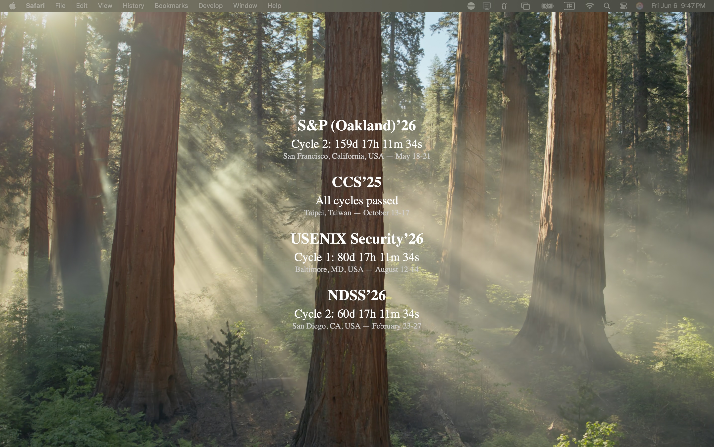

# 🔐 TOP4 Security Conference Countdown (Übersicht Widget)

A live countdown Übersicht widget for the **Top 4 security conferences**:

- IEEE S&P (Oakland)
- ACM CCS
- USENIX Security
- NDSS

Counts down to **multi-cycle deadlines** using **AoE time (UTC−12)**.

---

## ✨ Features

- Live countdown, updated every second
- Auto-fetches the latest deadlines from `sec-deadlines.github.io`
- Supports multiple cycles (e.g., Cycle 1, Cycle 2)
- Timezone-aware (AoE)
- Weekly cache update to reduce bandwidth
- Clean and minimal layout

---

## 📦 Install

### 1. Install [Übersicht](http://tracesof.net/uebersicht/)

Make sure you have Übersicht installed on your Mac.

### 2. Clone this widget into your Übersicht widgets folder:

```bash
cd ~/Library/Application\ Support/Übersicht/widgets
git clone https://github.com/Happy2Git/Security_Top4_Countdown.git
```
### 3. Install dependencies:

```bash
brew install yq jq
```
### 4. Refresh Übersicht:

Click on **Übersicht → Refresh All Widgets** in the menu bar.

---

## 🧠 Data Source

* [sec-deadlines](https://github.com/sec-deadlines/sec-deadlines.github.io)

---

## 🗂 Files
```
security_top4_countdown/
├── top4_data.coffee   # Widget logic
├── top4_data.json     # Cached data
├── top4_fetch.sh      # Script to cache and filter weekly
```
---

## 📸 Screenshot



---

## 📄 License

MIT License

---

## 🙌 Credits

Built using data from [sec-deadlines](https://github.com/sec-deadlines/sec-deadlines.github.io)

Widget by Clawen(Cheng-Long Wang)

````